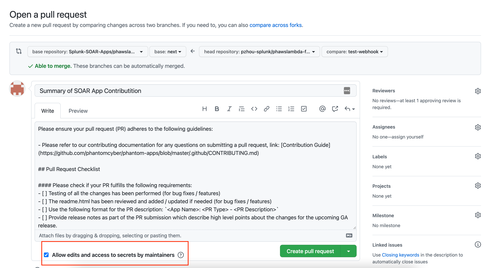

# Step-by-Step Guide for Contributing to a Splunk SOAR App

## Step 1: Fork the app repo

1. This will create a copy of the app repo under your GitHub account
1. With your fork, you will be able to make changes or additions and open up pull requests to the original repo

## Step 2: Clone your forked repo locally

1. Clone your forked apps repo locally using HTTPS or SSH (see [cloning-a-repository](https://docs.github.com/en/repositories/creating-and-managing-repositories/cloning-a-repository) for more details)
1. The example below uses SSH to clone a forked repo

  ```
  # Clone your forked repo 
  $ git clone git@github.com:your-username/app-repo-fork.git
  
  # Set the original repo as the upstream
  $ git remote add upstream git@github.com:splunk-soar-apps/app-repo.git 
  
  # Sync with the latest changes on the upstream's next branch
  $ git checkout next
  $ git pull upstream next
  ``` 
  
## Step 3: Make your changes

1. Now that you have cloned your fork and synced up with the main upstream repo, you are ready to start working!
1. Perform the following commands to start working on your issue:

  ```
  # Create a working branch off of the next branch
  $ git checkout -b your-branch
  
  # Once you are finished with your changes/additions
  $ git add .
  $ git commit -m "Commit message here"
  $ git push origin your-branch
  ``` 

## Step 4: Finally, create a Pull Request on GitHub
 
 1. The final step is to create a pull request from `your-username/app-repo-fork:your-branch` into `splunk-soar-apps/app-repo:next` for the Splunk>SOAR Engineering team to review your code changes and provide feedback
 1. In order for the Splunk>SOAR team to properly aid you in the PR process, please make sure to check the 'Allow edits and access to secrets by maintainers' box which is shown in the image below.
 1. Please ensure your pull request adheres to the guidelines mentioned in [PULL REQUEST TEMPLATE](https://github.com/splunk-soar-apps/.github/blob/main/.github/pull_request_template.md).
 
