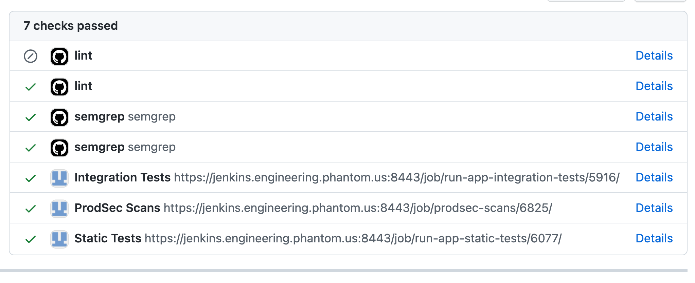
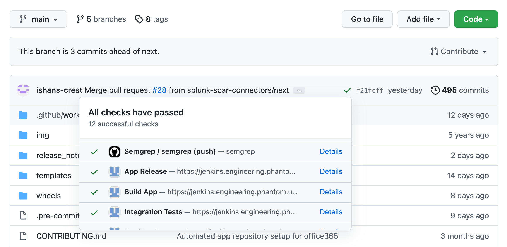

# Partners Guide for Splunk SOAR Connectors
A partner of a developer-supported connector is given the following permissions.
 - [Maintain](https://docs.github.com/en/organizations/managing-access-to-your-organizations-repositories/repository-roles-for-an-organization)
permissions to the connector's repo in GitHub - allowing them to review and merge contributions made to the repo.
 - Edit permissions to the connector's page on [Splunkbase](https://splunkbase.splunk.com/).

# Reviewing Pull Requests
As a partner of a repo, you will be able to review and merge its pull requests.
When reviewing a PR, please ensure that all automated checks are passing before merging the PR.
Otherwise, please notify a member of the Connectors team to review any failing checks
that you may be unsure of how to resolve.

# Contributing Changes
As a partner of a repo, you will be given read/write access to clone and push to remote branches.
Please take the following steps to contribute a change and have it published to Splunkbase!
  1. Clone the `main` branch of the repo (`main` should be the branch checked out by default).
  1. Install [pre-commit](https://pre-commit.com/#install) on your system, if not already installed,
     and then run `pre-commit install` while inside the app repo. _Note: This step is not required, but **strongly** recommended! It will allow you to catch issues before even pushing any code._
  1. Create a local `feature` branch from `main` and make your changes on `feature`.
     Please append any release notes you have for your change to `release_notes/unreleased.md` as **bulleted lists**. [Example](https://github.com/splunk-soar-connectors/screenshotmachine/commit/679403aaee1c5d92adcc9c7743deba419d519c9f)
  1. Remember to add your name to the contributors list in the app JSON! [Example](https://github.com/splunk-soar-connectors/smime/blob/main/smime.json#L14)
  1. Push your `feature` branch to the remote repo, and ensure all automated checks are passing for your
     branch to prevent any delays in the publishing process.
     
     1. Open a pull request merging `feature` to `main`, and notify the Connectors team or another partner of the repo to review your PR.
     1. Once the PR is approved, you can merge your `feature` branch to `main`!
     1. The release process kick off following this merge.
  1. After merging to `main`, wait for the `App Release` commit status to appear next to its head
     commit as successful :white_check_mark:.
     - If the commit status shows up as failed :x:, please create an issue in the repo to get assistance
       from the Connectors team.
  
  1. Find your updated app [on Splunkbase](https://splunkbase.splunk.com/apps/#/product/soar/)!
