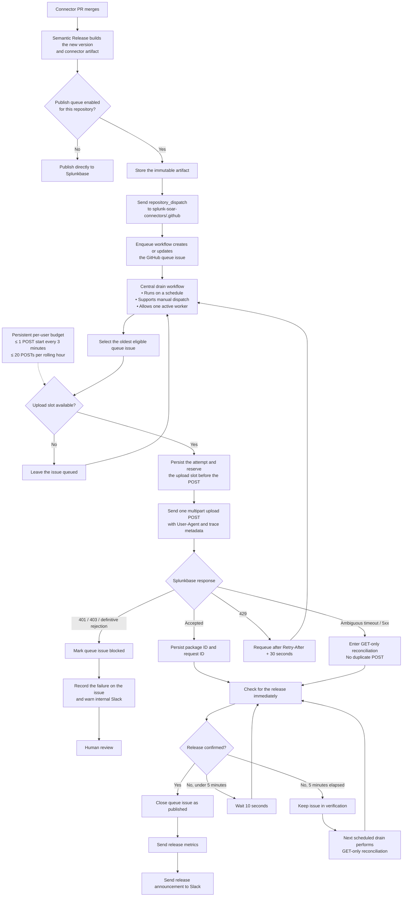

# Splunkbase connector publishing

Splunk SOAR connector releases use a centralized queue in
`splunk-soar-connectors/.github` to publish to Splunkbase. The queue provides durable
publication state, enforces the upload limit for the shared publishing identity, and
prevents an uncertain upload result from causing a duplicate submission.

## Publishing flow

When the queue is enabled for a connector repository, its release workflow stores the
immutable connector artifact and sends a `repository_dispatch` event to the central
repository. The `enqueue-splunkbase-publish.yml` workflow handles the event and creates
or updates the GitHub issue that represents the publication.

The `drain-splunkbase-publish-queue.yml` workflow is the central worker. It runs on a
schedule and can also be started manually with `workflow_dispatch`. A concurrency group
allows only one worker to drain the queue at a time.

## Queue model

Each publication is represented by:

- A GitHub issue containing the connector, version, source run, current state, and
  non-secret Splunkbase identifiers.
- An immutable connector artifact stored on the `splunkbase-publish-queue` prerelease.
- A deduplication key composed of the publishing-user alias, repository, and connector
  version.

The queue processes the oldest eligible issue. Publication credentials remain in
GitHub Actions secrets and are not stored in issues or release assets.

## Upload budget

Splunkbase permits 20 upload attempts per hour for each publishing user, and every
multipart upload attempt counts. The queue starts at most one upload every three
minutes and no more than 20 during the preceding hour.

Each worker run drains eligible work for at most one hour or 20 started upload attempts,
whichever comes first. It records an upload slot before making the POST, so a restart
cannot reset the budget. Read-only Splunkbase requests retain bounded retries, but
multipart upload POSTs have no automatic retries. HTTP 429 responses schedule another
queue attempt after `Retry-After` plus 30 seconds. Ambiguous transport results enter
GET-only reconciliation and do not authorize another POST.

Manual uploads must not use the same publishing identity while the queue is enabled
because they are not represented in the persisted budget.

## Publication verification

After Splunkbase accepts an upload, the queue persists the package and request IDs and
checks for the release immediately. It checks every 10 seconds for up to five minutes.
If publication is still not confirmed, the issue remains in verification and a later
worker continues with GET requests only.

Release metrics and the standard Slack release announcement are sent only after the
connector version is confirmed on Splunkbase.

For SDK apps, metrics compare the manifest in the immutable queued package with a
manifest generated from the previous semantic-release tag. Metrics and Slack
notifications are attempted independently so one failure does not suppress the other.

## Failure handling

| Condition | Queue behavior | Notification |
| --- | --- | --- |
| HTTP 429 | Requeue after `Retry-After` plus 30 seconds | None |
| Ambiguous timeout or server response | Continue GET-only reconciliation | None |
| Validation still pending or response unreadable | Keep the issue in verification | None |
| HTTP 401 or 403 | Block the issue for human review | Internal Slack warning |
| Definitive validation rejection | Block the issue for human review | Internal Slack warning |

An active publication has a 15-minute lease. If the worker stops after recording an
attempt, the next eligible worker treats its result as ambiguous and performs GET-only
reconciliation.

The queue issue and internal blocked-publication warning include the connector, version,
specific failure reason, and worker-run link. Request and package IDs are included only
when the failure occurred after Splunkbase received an upload. The warning is independent
of `SEND_RELEASE_MESSAGE`, which controls standard release announcements.

Blocked issues remain open until an operator resolves the cause and explicitly
authorizes another queue attempt. An operator must not retry the multipart POST
directly.

## Configuration

The queue path is selected when `SPLUNKBASE_PUBLISH_QUEUE_ENABLED=true` is available to
both the connector repository and `splunk-soar-connectors/.github`. If the variable is
unset or `false`, the connector uses direct publication. Direct publication and queued
publication must not run simultaneously under the same Splunkbase identity.

The central repository uses the following Actions secrets:

- `SPLUNKBASE_USER`
- `SPLUNKBASE_PASSWORD`
- `SLACK_INTERNAL_TOKEN`
- `SLACK_COMMUNITY_TOKEN`

Slack behavior uses the following Actions variables:

- `SLACK_INTERNAL_CHANNEL_ID`
- `SLACK_COMMUNITY_CHANNEL_ID`
- `SEND_RELEASE_MESSAGE`

The connector release workflow uses `SEMANTIC_RELEASE_APP_ID` and
`SEMANTIC_RELEASE_PK` to obtain a token for storing the queue artifact and sending the
enqueue event. The GitHub App requires `contents:write` on
`splunk-soar-connectors/.github`. The central workflows use their repository-scoped
`GITHUB_TOKEN` with `issues:write` to manage queue issues.

CrowdSec remains excluded until its Splunkbase publishing-user invitation is accepted.
Microsoft OneDrive v2 remains excluded from queued publication.

## Tracing

Splunkbase uploads use the `Splunk-SOAR-Connector-Publisher/1.0` User-Agent and include
the connector repository, version, source workflow run, and source attempt. The queue
issue records package and request IDs when Splunkbase provides them.

## Disabling the queue

Set `SPLUNKBASE_PUBLISH_QUEUE_ENABLED=false` and wait for any active worker to finish
before resuming direct publication with the same Splunkbase identity.

_This documentation was written by Codex._
