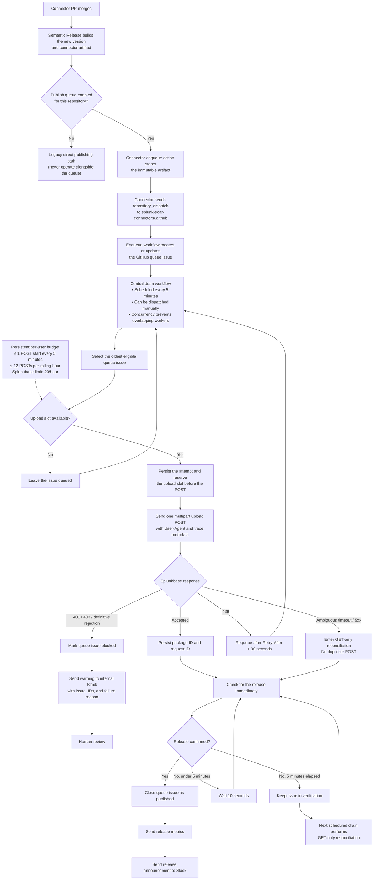

# Splunkbase publish queue

This runbook and the queue implementation were written by Codex.

Splunkbase permits 20 upload attempts per hour for each publishing user, and every
multipart upload attempt counts. Connector builds remain parallel, but this queue
serializes the upload POSTs made by the shared SOAR connector user.

## Publishing flow

The connector-side enqueue action stores the immutable release artifact and sends a
`repository_dispatch` event to the central `.github` repository. The
`enqueue-splunkbase-publish.yml` workflow handles that event by creating or updating
the GitHub issue that represents the queue item. Creating the issue does not start the
publisher.

The separate `drain-splunkbase-publish-queue.yml` workflow is the central worker. It
runs on a five-minute schedule and can also be started manually with
`workflow_dispatch`. Its concurrency group prevents overlapping workers. When a
publication is definitively blocked, the worker sends an internal Slack warning with
the connector, version, queue issue, request and package IDs, and failure reason. This
warning is not gated by `SEND_RELEASE_MESSAGE`.

## Safety properties

The worker starts at most one upload every five minutes and no more than 12 uploads
during the preceding hour. It records a slot before making the POST. A worker restart
therefore cannot reset the budget. Read-only Splunkbase requests retain bounded retries,
but multipart upload POSTs have no automatic retries.

Queue items are GitHub issues in this repository. Artifacts are uniquely named assets on
the `splunkbase-publish-queue` prerelease. Both contain only public connector and
operational metadata; credentials remain in GitHub Actions secrets. The deduplication
key is publishing-user alias, repository, and connector version.

## Configuration

After this change merges, open
`splunk-soar-connectors/.github` → **Settings** → **Secrets and variables** →
**Actions**.

Under **Secrets**, add these repository secrets, or grant this repository access to the
existing organization secrets with the same names:

- `SPLUNKBASE_USER`: the shared connector publishing username
- `SPLUNKBASE_PASSWORD`: the shared connector publishing password

Slack configuration is optional. If release notifications must remain enabled, also
make these secrets available to this repository:

- `SLACK_INTERNAL_TOKEN`
- `SLACK_COMMUNITY_TOKEN`

Under **Variables**, make the existing channel configuration available when Slack
notifications are enabled:

- `SLACK_INTERNAL_CHANNEL_ID`
- `SLACK_COMMUNITY_CHANNEL_ID`
- `SEND_RELEASE_MESSAGE=true`

The enqueue job reuses the GitHub App `splunk-soar-semantic-release` (App ID `1190653`).
Connector workflows supply its ID through the existing `SEMANTIC_RELEASE_APP_ID`
organization variable and pass its private key through `SEMANTIC_RELEASE_PK`. This App
has `contents:write`, `metadata:read`, and `pull_requests:write` across the connector
organization. The queue uses only `contents:write` on
`splunk-soar-connectors/.github`; it does not need issue, Actions, check, or status
permissions. No GitHub App permission change is required for this queue. The central
workflow uses its repository-scoped `GITHUB_TOKEN`, with `issues:write` declared in the
workflow, to create and update queue issues.

Keep `SPLUNKBASE_PUBLISH_QUEUE_ENABLED` unset or `false` while configuring. The reusable
workflow continues to publish directly in that state, with one upload POST per job.

For the canary:

1. In each of the five approved connector repositories, open **Settings** →
   **Secrets and variables** → **Actions** → **Variables** and add
   `SPLUNKBASE_PUBLISH_QUEUE_ENABLED=true`.
2. In `splunk-soar-connectors/.github`, add the same repository variable with value
   `true`. This enables the scheduled central worker.
3. After the canary passes, make `SPLUNKBASE_PUBLISH_QUEUE_ENABLED=true` available to
   all connector repositories, preferably as one organization variable, while keeping
   it available to this central repository.

No other repository setting needs to change. Issues and Actions are already enabled,
the required actions are already allowlisted, and the repository's `GITHUB_TOKEN`
already has read/write workflow permissions.

## Canary

Enqueue five approved connector versions together. Verify:

1. Five open issues appear with `splunkbase-publish` and `splunkbase-queued`.
2. The state issue records no starts less than five minutes apart.
3. Each successful issue closes with `splunkbase-published`.
4. Metrics and Slack notifications run only after the worker confirms publication.
5. Splunkbase logs show the stable `Splunk-SOAR-Connector-Publisher/1.0` User-Agent plus
   repository, version, source run, and source attempt fields.

Do not canary CrowdSec until its publishing-user invitation is accepted. Do not use
Microsoft OneDrive v2 as a canary.

## Recovery

An active item carries a 15-minute lease. If a worker dies, the item becomes eligible
again after the lease. If a counted attempt was started, the next worker treats the
outcome as ambiguous and performs GET-only reconciliation; it does not reserve another
slot or issue another POST. The app-existence snapshot is persisted before the publisher
runs so a newly created app can still receive its editors during recovery.

HTTP 429 requeues the item after `Retry-After` plus 30 seconds and makes no second POST.
HTTP 401 or 403 and definitive validation failures leave the issue open with
`splunkbase-blocked`. Once Splunkbase accepts a POST, the worker immediately persists
the package and request IDs and moves any inconclusive status check to
`splunkbase-verifying`. Verification workers use only release-list and package-status
GETs; they neither reserve another upload slot nor send another multipart POST.
Continued validation, timeouts, exhausted server-error retries, and unreadable
responses remain in verification. The issue closes when the version appears or the
package validates, while a definitive rejection transitions to `splunkbase-blocked`
and fails the worker job.

To retry a corrected blocked item, preserve its JSON body, replace
`splunkbase-blocked` with `splunkbase-queued`, and set `not_before` to the current UTC
time. To explicitly retry an interrupted attempt whose result never became durable,
replace `splunkbase-verifying` with `splunkbase-queued`, clear `verification`, and change
its latest attempt `outcome` from `started` to `retry_authorized`. Do not rerun a POST
manually under the same user while the queue is enabled, because manual attempts are
invisible to the persisted budget.

To disable the queue, set `SPLUNKBASE_PUBLISH_QUEUE_ENABLED` to `false`. Wait for any
active worker to finish before using direct publication. Do not operate both paths
simultaneously under the same Splunkbase user.
